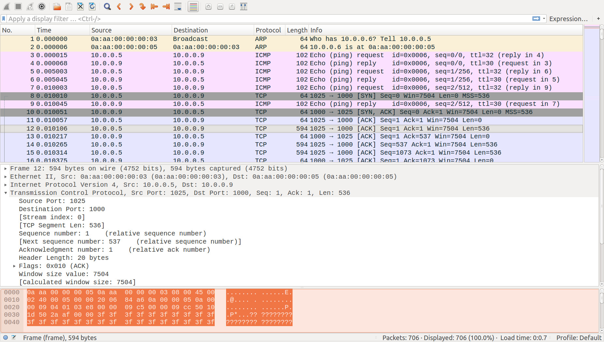
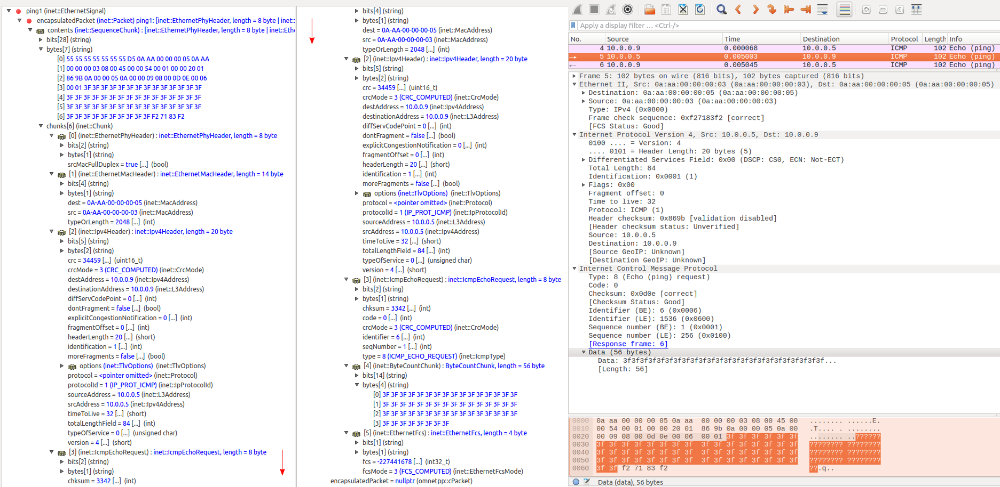

TODO: this is not wireless...need new category ?

## Goals

INET has support for recording PCAP traces from simulations. The recording
process produces PCAP files that are similar to real world PCAP traces,
so one can use the same tools and techniques for analyzing simulated traffic as used on real traffic, such as Wireshark and TCPDump. Knowledge of PCAP can be reused in the context of simulations.

This showcase contains an example simulation, which generates and records PCAP traces of TCP, UDP, and ICMP
traffic, using various physical layer protocols like ethernet and 802.11.

INET version: `4.0`<br>
Source files location: <a href="https://github.com/inet-framework/inet-showcases/tree/master/wireless/pcaprecording" target="_blank">`inet/showcases/wireless/pcaprecording`</a>

## The model

In order to record PCAP traces in a node, a `PcapRecorder` module needs to be included in the node.
Pcap recorder modules can be easily included in hosts and routers by specifying their `numPcapRecorders` parameter (available in modules that extend `LinkLayerNodeBase`, such as  `StandardHost` and derivatives, and router modules.)

The PCAP recorder module records L2 frames sent to and from modules that are in the same host as the PCAP recorder module.
The module only records packets that contain IPv4 packets (those not containing IPv4 are discarded.) It writes traces in a PCAP file, which has to be specified by the `pcapFile` parameter.
This parameter acts as the main switch for recording, thus specifying this parameter enables packet capture. <!--The pcap recorder module also creates TCPDump-like output on the module log, if the `verbose` parameter is set to `true`. TODO: enable when its working-->
The PCAP file's link layer header type needs to be set with the `pcapNetwork` parameter, so PCAP programs interpret the traces correctly. The most important type codes are the following:

- ethernet: 1
- 802.11: 105
- ppp: 204

The modules to record can be specified by the `moduleNamePatterns` parameter, which takes
a space separated list of module names. For selecting a module vector, `[*]` can be used. The recorded modules are on the same level as the PCAP recorder module. The default value for the `moduleNamePatterns` parameter is `wlan[*] eth[*] ppp[*] ext[*]`, so it records the most commonly present interfaces.
The `dumpProtocols` parameter selects which protocols to include in the capture. The parameter's default is `"ethernet ppp ieee80211"`.

When a node connects to the network via just one kind of interface, specifying the link layer header type is sufficient for capturing a proper trace. However, if there are multiple kinds of interfaces the node connects with, the set of captured interfaces or physical layer protocols should be narrowed to the ones with the link layer header type specified by the `pcapNetwork` parameter. It is needed because traffic for all interfaces are included in the trace by default.
Multiple PCAP recorder modules need to be included in the network to record packets with different link layer headers. One PCAP recorder module can only record traces with one link layer header type, thus the packets with the other header types would not be recognized by PCAP programs.

TODO: dumpBadFrames?

### The configuration

The example simulation for this showcase contains wired and wireless hosts, and routers.
The hosts are configured to generate TCP, UDP and ICMP traffic. The hosts connect to routers
via ethernet, the connection between the routers is ppp. The wireless hosts communicate via 802.11.
The simulation can be run by choosing the `PcapRecording` configuration from the ini file.
The simulation uses the following network:


The network contains two `adhocHost`s named `host1` and `host2`, and two `StandardHost`s named `ethHost1` and `ethHost2`. There are two `Router` modules (`router1` and `router2`), which are connected to each other by ppp. Each wired host is connected to one of the routers via ethernet.
The network also contains an `Ipv4NetworkConfigurator`, an `Ieee80211ScalarRadioMedium`, and an `IntegratedMultiVisualizer` module.

Traffic generation is set up the following way: `host1` is configured to send a UDP stream to `host2` (via 802.11), `ethHost1` is configured to open a TCP connection to `ethHost2`, and send a 1Mbyte file (via ethernet). Additionally, `ethHost1` is configured to ping `ethHost2`.

There are `PcapRecorder` modules added to `host1`, `ethHost1`, and `router1`. The keys in the ini file pertaining to PCAP recording configuration are the following:

```
*.host1.numPcapRecorders = 1
*.host1.pcapRecorder[*].pcapNetwork = 105	# 802.11
*.host1.pcapRecorder[*].pcapFile = "results/host1.pcap"

*.ethHost1.numPcapRecorders = 1
*.ethHost1.pcapRecorder[*].pcapNetwork = 1	# ethernet
*.ethHost1.pcapRecorder[*].pcapFile = "results/ethHost1.pcap"

*.router1.numPcapRecorders = 2
*.router1.pcapRecorder[0].pcapNetwork = 204	# ppp
*.router1.pcapRecorder[0].moduleNamePatterns = "ppp[*]"
*.router1.pcapRecorder[0].pcapFile = "results/router1.ppp.pcap"
*.router1.pcapRecorder[1].pcapNetwork = 1	# ethernet
*.router1.pcapRecorder[1].pcapFile = "results/router1.eth.pcap"
*.router1.pcapRecorder[1].moduleNamePatterns = "eth[*]"
```

We configure `host1`'s PCAP recorder to use the 802.11 link layer headers, and `ethHost1`'s PCAP recorder to use ethernet link layer headers. There are two PCAP recorder modules in `router1`, with one of them recording ethernet traffic on `eth0` and the other ppp traffic on `ppp0`.
<!--Since `router1` has two different kinds of interfaces (eth and ppp), both of them can only be recorded using two pcap recorder modules, each set to the appropriate link layer header type. The `moduleNamePatterns` parameter is set to match the link layer header type, so only those packets are recorded. Otherwise, there would be packets that cant be made sense of by the pcap progams. TODO: not needed-->

## Results

The following video shows the traffic in the network:

<video autoplay loop controls src="pcap1.mp4" onclick="this.paused ? this.play() : this.pause();"></video>
<!--internal video recording, playback speed 1, no animation speed, run until first sendTimer (t=0.002), step, stop at about 10.5 seconds simulation time-->

The following screenshot shows some PCAP files open in Wireshark.

### host1.pcap:


### ethHost1.pcap:



### router1.ppp.pcap:


The following screenshot shows `ethHost1.pcap` opened with TCPDump:


TCP data, ethHost1 (from ethHost1 to ethHost2):


Ping request, router1 eth (from ethHost1 to router1): TODO redo this



Ping request, router1 eth (from ethHost1 to router1):


TODO: include packet list in on of the screenshot -> so you can click on a packet to see the details

TCP ACK, router(ppp) (from ethHost1 to ethHost2):


TODO: remove overlap

TODO: wifi screenshot
