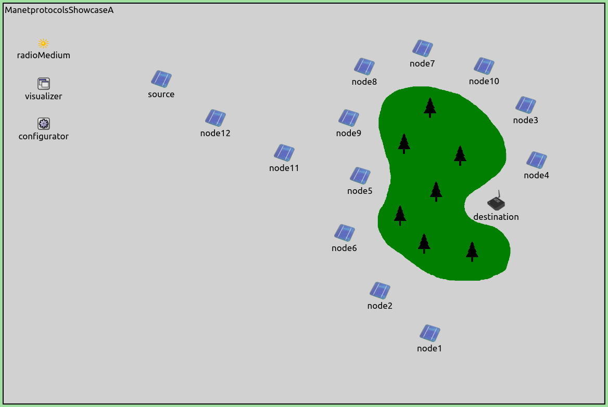

## Goals

Routing protocols for mobile adhoc networks (MANETs) often fall into two major categories: reactive and proactive. INET contains various routing protocols for MANETs from both categories, and other categories as well.

<!-- This showcase demonstrates three manet routing protocols with three example simulations. There is a simulation demonstrating manet routing with a reactive protocol (Aodv), a proactive protocol (Dsdv), and a manet routing protocol that is neither reactive nor proactive (Gpsr). -->

<!-- This showcase demonstrates three manet routing protocols with three example simulations, using a reactive (aodv), a proactive (dsdv), and a location based (gpsr) routing protocol. -->

This showcase demonstrates the configuration, operation and comparison of three manet routing protocols with three example simulations, using a reactive (aodv), a proactive (dsdv), and a location based (gpsr) routing protocol.

<!-- INET contains various routing protocols for simulating mobile adhoc networks (manets). Routing protocols for manets often fall into
on of two major categories: proactive and reactive. This showcase demonstrates
three manet routing protocols with three example simulations. It demonstrates a reactive (Aodv) and a proactive (Dsdv)
routing protocol, as well as one that is neither reactive nor proactive, but geographic location based (Gpsr). -->

<!-- TODO: it demonstrates how to configure it ?
TODO: comparison -->

INET version: `4.0` 
Source files location: <a href="https://github.com/inet-framework/inet-showcases/tree/master/routing/manetprotocols" target="_blank">`inet/showcases/routing/manetprotocols`</a>

## About MANETs

<!-- manets are mobile so there is no infrastructure and it is dynamic so we need protocols that can
work in the environment. reaction time and scalability. -->

MANETs are ad hoc networks comprised of wireless nodes, which are often mobile. Given the mobile nature of the nodes, the network topology can change dynamically. The nodes create their own network infrastructure, and each node also acts as a router, forwarding traffic in the network. MANET routing protocols need to adapt to changes in the network topology and continuously maintain routing information to be able to forward packets to their destinations.

<!-- TODO: keywords: autonomous, wireless, self-configuring, continuously maintain information to properly route. each node is a router, forwarding traffic not mean for him. transport layer ? -->

<!-- MANETs operate without any existing infrastructure. Only the nodes create the network. Each node acts as a router, and the topology of the network is continuously changing. MANET routing protocols need to adapt to these changes in the network to be able to forward packets to their destinations. -->

There are two main types of MANET routing protocols, reactive and proactive (although there are others which don't fit into either category.) `Reactive` or on-demand routing protocols update routing information when there is an immediate demand for it, i.e. one of the nodes wants to send a packet (and there is no working route to the destination.) Then, they exchange route maintenance messages, and forward the packet. The routes stay the same until there is an error in a packet's forwarding, i.e. the packet cannot be forwarded anymore due to a change in the network topology. These type of protocols require less overhead than proactive protocols, but also might react more slowly to changes in the network topology. Examples of reactive MANET routing protocols include AODV, DSR, ABR, etc. `Proactive` or table-driven routing protocols continuously maintain routing information, so the routes in the network are always up to date.
This typically involves periodic routing maintenance messages exchanged throughout the network.
These types of protocols use more maintenance transmissions than reactive protocols in order to make sure the routing information is always up-to-date (they update it even when there is no change in the network topology.)
Due to the up-to-date nature of routing information, latency is lower than in the case of reactive protocols. Examples of reactive MANET routing protocols include DSDV, OLSR, Babel, etc.
There are other types of MANET routing protocols, such as Hybrid (both reactive and proactive), Hierarchical, and Geo routing.

INET features many routing protocols, for MANETs, and other uses (including wired and wireless cases.)
See <a href="https://github.com/inet-framework/inet/tree/master/src/inet/routing" target="_blank">`/inet/src/inet/routing`</a> directory for the available routing protocols.

The example simulations in this showcase features the reactive protocol `Ad hoc On-Demand Distance Vector routing` (AODV), the proactive protocol `Destination-Sequenced Distance Vector routing` (DSDV),
and the geo routing protocol `Greedy Perimeter Stateless Routing` (GPSR). The following section details these three protocols briefly.

### About AODV

AODV is a reactive (or on-demand) MANET routing protocol, and as such, it maintains routes
for which there is a demand in the network (i.e. packets are frequently sent on the route.)
AODV uses IP addresses to address packets, and maintains a routing table with the next hop for reaching destinations. Routes time out after a while if not used. AODV features the following routing message types:

- `RREQ`: Route request
- `RREP`: Route reply
- `RERR`: Route error

TODO: there is another kind, hello messages
TODO: actually, AODV is both reactive and proactive, but hello messages are disabled by default in INET

When a node wants to send a packet, and it doesn't know the route to the destination, it initiates route discovery, by sending an `RREQ` multicast message. The neighboring nodes record where the message came from, and forward it to their neighbors, until the message gets to the destination node. The destination node replies with an `RREP`, which gets back to the source on the reverse path along which the `RREQ` came. <!--The intermediate nodes record the route towards the destination, as the RREP gets back to the source.-->
Forward routes are set up in the intermediate node as the `RREP` travels back to the source.
An intermediate node can also send an `RREP` in reply to a received `RREQ`, if it knows the route to the destination, thus nodes can join an existing route. When the `RREP` arrives at the source, and the route is created, communication can being between the source and the destination. If a route no longer works, i.e. messages cannot be forwarded on it, `RERR` messages are broadcast, and this triggers route discovery.
As a reactive protocol, AODV has less overhead than proactive ones, but reacts to changes in network topology slower.

### About DSDV

V1

DSDV is a proactive (or table driven) MANET routing protocol, so it makes sure routing information in the network is always up-to-date. It maintains a table with the best routes to each destination. The table contains all other nodes a node knows about either directly because it's a neighbor, or indirectly through neighbors. The table contains nodes' IP addresses, last known sequence number and hop count required to reach it, and the next hop. Routing information is frequently updated, so all nodes have the best routes in the network.
Routing information is updated in two ways:

- Nodes broadcast their entire routing tables periodically
- Nodes broadcast small updates when a change in their routing table occurs

A node updates a routing table entry if it receives a better route. A better route is one that has a higher sequence number, or a lower hop count if the sequence number is the same.
TODO: this detail is probably not needed.

V2

DSDV is a proactive (or table-driven) MANET routing protocol, where nodes maintain a routing table of the best distances for destinations in the network. The routing tables are updated periodically, and when there is a change in a node's routing table (a better route becomes available.)
TODO: about performance

<!-- TODO
The most important is:

all nodes maintain the best routes to destinations. they are frequently updated. they periodically
broadcast their entire routing tables, and send smaller updates when a change occurs in their routing tables. -->

### About GPSR

<!-- TODO: about ability to circumvent voids.
TODO: greedy is used whenever possible, perimeter is used whenever greedy cannot be.
TODO: keywords: locally optimal greedy choice in next hop...successively closer geographic hops
periodically broadcast its IP and position (x and y coordinates)
if no beacon is received after some time from a known neighbor, the entry is deleted,
and the neighbor is assumed to have gone out of range. also, 802.11 mac retransmission
failures cause the entry to be deleted (it is interpreted the same way)
A node has only information of the nodes in its vicinity/immediate neighbors
the beaconing proactive behavior...position is attached to all packets...thus all packets
serve as beacons (the inter beacon timer is resetted at every packet send...recuding time between beacons at parts of the network with active traffic) -->

GPSR is a geographic location based routing protocol. Each node maintains the addresses and geographical co-ordinates of its neighbors, i.e. other nodes in its communication range. Nodes advertise their locations periodically by sending beacons. When no beacons are received from a neighboring node for some time, the node is assumed to have gone out of range, and its table entry is deleted. A table entry for a node is also deleted after 802.11 MAC retransmission failures.
Nodes attach their location data on all sent and forwarded packets as well. Each packet tranmission resets the inter beacon timer, reducing the required protocol overhead in parts of the network with frequent packet traffic.

Destination selection for packets is not address based, but packets are addressed to a location specified with co-ordinates. The destination node is actually the one which is the closest to the destination co-ordinates. The protocol operates in one of two modes:
<!--- In greedy routing mode, the next hop is the neighboring node which is geographically closest to the destination's location. Eventually, the packet reaches the destination. /* If a node should forward a packet, but doesn't know about any nodes that are closer to the destination than itself, it switches the packet to perimeter routing mode.*/ If a node should forward a packet, but it is closer to the destination than any of its neighbors, it switches the packet to perimeter mode.-->
- In greedy mode, a node forwards a packet to its neighbor which is geographically closest to the destination node. Thus the packet gets gradually closer to its destination with every hop. If a forwarding node is closer to the destination than any of its neighbors, the node switches the packet to perimeter mode. In this case, the packet must take a route that takes it farther from its destination temporarily - it routes around a void, a region without any nodes to route to.
- In perimeter routing mode, the packet can circumnavigate a void. When the packet is in this mode, nodes create a planar graph of their neighboring nodes based on their location, where vertices represent nodes and edges represent possible paths between nodes. Nodes use the right hand rule for forwarding packets, i.e. they forward the packet on the first edge to the right, compared to the edge the packet arrived from. Each node does this, until the packet arrives at its destination, or at an intermediate node which is closer to the destination than the one at which the packet was switched to perimeter mode. In the latter case, the packet is switched to greedy mode. If the packet is in perimeter mode and would be forwarded on an edge that it has been forwarded on previously, it is discarded (there is no route to the destination.) <!--can forward the packet to another node which is closer to the destination (in which case the packet is switched to greedy mode.)--> <!--If a packet is in perimeter mode and arrives at node it has been at previously, then it is discarded. TODO: how does this work?-->

TODO: parameters can be according to the mobility rate and the communication ranges in the network.
or maybe this belongs in the configuration section.

TODO: this seems too big

TODO: some properties of the protocol...its not very good for fast moving nodes

TODO: sometimes the node doesnt know the location of all its neighbors (if they havent yet received a beacon from them)

TODO: about this much is enough about each protocol. Should be BRIEF.

<!-- TODO
About manets and routing protocols in general
About the three routing protocols briefly
Then about the configuration and networks
Then the results

then the statistic results ? or thats for later

Maybe something like Part I: demonstrating the protocols
                     Part II: comparing the protocols based on statistics, and how to do a parameter
                              study

The part II would involve: selecting a network, and mobility scenario. Making sure the results are seed independent. Then should run a study which selects the best performing parameter settings for each protocol. Then comparing the three protocols. Can you use the results from the study which looks for the best parameter values as the final results ? -->

## Configuration and Results

This section contains the configuration and results for the three simulations.
The three simulations will demonstrate the MANET routing protocols `AODV`, `DSDV` and `GPSR`.
They will use two networks, `ManetRoutingProtocolsShowcaseA` and `ManetRoutingProtocolsShowcaseB`, defined in <a srcfile="routing/manetprotocols/ManetProtocolsShowcase.ned"/>. Both networks contain  hosts of the type `ManetRouter`, whose routing module type is configurable. There is a source host named `source`, a destination host named `destination`, and a number of other hosts, which are named `node1` up to `node10`. In addition to mobile nodes, both networks contain an `Ieee80211ScalarRadioMedium`, an `Ipv4NetworkConfigurator`, and an `IntegratedMultiVisualizer` module.

In all three simulations, the source node pinging the destination node.
Since routes are managed dynamically by the MANET routing algorithms, the `Ipv4NetworkConfigurator` module is instructed not to add any routes (it will only assign IP addresses). The netmask routes added by the interfaces are disabled as well. The following keys in the `General` configuration in <a srcfile="routing/manetprotocols/omnetpp.ini"/> achieve this:

<pre class="snippet" src="omnetpp.ini" from="configurator" upto="netmaskRoutes"></pre>

TODO: mobility

### AODV

The example simulation featuring AODV is defined in the `Aodv` configuration in <a srcfile="routing/manetprotocols/omnetpp.ini"/>. This configuration uses the `ManetProtocolShowcaseA` network. The network looks like the following:

TODO: network image

- nodes are scattered
- the source and the destination are stationary
- the other nodes move linearly in random directions
- they relay the ping packets between source and destination

In INET, AODV is implemented by the `Aodv` module. This is configured in omnetpp.ini as the routing protocol type in `ManetRouter`:

<pre class="snippet" src="omnetpp.ini" from='"Aodv"' until=" "></pre>

The `Aodv` module has many parameters for tweaking the operation of the protocol. All of the parameters have default values, and `Aodv` works without setting any of the parameters. We set two of the parameters:

<pre class="snippet" src="omnetpp.ini" from="activeRouteTimeout" upto="deletePeriod"></pre>

The `activeRouteTimeout` parameter sets the timeout for the active routes. If the routes are not used for this period, they become inactive. The `deletePeriod` parameter sets the period after which the inactive routes are deleted. The `activeRouteTimeout` parameter is lowered from the default 3s to 1s, the `deletePeriod` parameter is lowered from the default 15s to 0.5s in order to make the protocol react better to the rapidly changing network topology. WHY IS THIS GOOD FOR THAT PURPOSE?

- results

<video autplay loop controls onclick="this.paused ? this.play() : this.pause();" src="Aodv1.mp4"></video>

<!--internal video recording, debug mode, normal run, animation speed none, zoom 1.54-->

<!-- TODO
aodv is done by the aodv module. it can be set in the manetrouter. it has a lot of parameters,
but we leave them at their defaults, only set two of them, to tweak the protocol for the mobility
in the network. Essentially, it makes the protocol react to changes faster. -->

### DSDV

TODO: there is no periodic updates -> full routing table dumps (incomplete implementation)
still seems they send hello message periodically

The example simulation featuring DSDV is defined in the `Dsdv` configuration in omnetpp.ini. Just like the AODV configuration, this one uses the `ManetRoutingProtocolsShowcaseB` network as well.

The DSDV protocol is implemented in the `Dsdv` module. The routing protocol type in all hosts is set to use DSDV:

<pre class="snippet" src="omnetpp.ini" from='"Dsdv"' until=" "></pre>

Like `Aodv` (and most routing protocol modules), `Dsdv` has many parameters with default values that yield a working simulation without any configuration. In this simulation, similarly to the previous one, we set two parameters of the protocol:

<pre class="snippet" src="omnetpp.ini" from="helloInterval" upto="routeLifetime"></pre>

The `helloInterval` parameter controls the frequency of the periodic updates, or hello messages. Setting this parameter to longer decreases the protocol overhead, but the network will react more slowly to changes in topology. We lower it to make the network more adaptive to rapid changes.
The `routeLifetime` parameter sets after how long the routes expire. TODO: more on this?

-results

### GPSR

The example simulation featuring GPSR is defined in the `Gpsr` configuration in omnetpp.ini. It uses the `ManetRoutingProtocolsShowcaseB` network. The network looks like the following:

The nodes are laid out along a chain. There is forest, which represents a void that Gpsr can route around. In this example simulation, the nodes will be static (though Gpsr is suitable for scenarios with moving nodes.) Source will ping destination, which is on the other side of the void.

- configuration for gpsr

- results

<video autoplay loop controls onclick="this.paused ? this.play() : this.pause();" src="Gpsr1.mp4"></video>

<!--simple screen recorder, 10 fps, normal run-->
