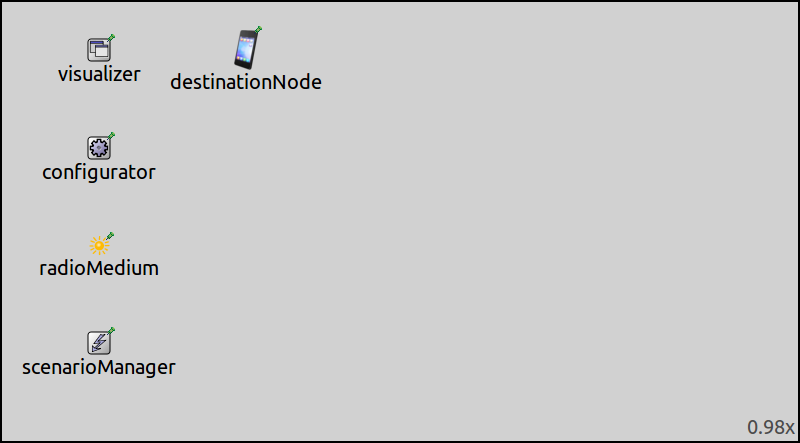

## Goals

<!--
INET has support for simulating dynamic networks, i.e. networks in which nodes can be created
and deleted during the course of the simulation, instead of a static network where the same nodes
are present in the entire course of the simulation.
-->

INET has support for simulating dynamic networks, i.e. networks in which nodes can be created
and deleted during the course of the simulation. This is in contrast to static networks where the same nodes
are present in the entire course of the simulation.

This showcase demonstrates dynamic networks, and contains an example simulation in which wireless nodes are
created, exist for some time, and then they are deleted. While in existence, they move around and send ping request
messages.

INET version: `4.0`<br>
Source files location: <a href="https://github.com/inet-framework/inet-showcases/tree/master/wireless/dynamic" target="_blank">`inet/showcases/wireless/dynamic`</a>

## The model

The `ScenarioManager` module can be used to create and destroy nodes during simulations (it can also change many aspects of the configuration while the simulation is running, but those features are out of scope for this showcase.) The scenario manager module takes an XML script input. The XML script describes the actions to be taken during the course of the simulation, i.e. which parameter should be changed and when, what nodes should be created or deleted and when, etc. (For a more comprehensive description, refer to the <a href="https://omnetpp.org/doc/inet/api-current/neddoc/index.html?p=inet.common.scenario.ScenarioManager.html" target="_blank">ScenarioManager NED documentation</a> in the INET Reference.)

- creating and destroying nodes
- the config
- the results

<!--
TODO:

The ScenarioManager takes an XML config file. This has a <scenario> tag
and the creation and destruction of nodes can be done with the create and delete tag

The `ScenarioManager` executes an XML script. The script shedules events to take place at certain times
during the simulation. It can change module parameters, add or remove connections, change parameters of connections, and create or delete network nodes.

The script contains a `<scenario>` element. Under this element, there can be multiple elements...

So there can be multiple element. Each executes a command, and have a t parameter which specifies the time it should be executed. There is the <at> element which just has the time, and there can be any number of elements under it, which will be executed at the specified time.

The available commands include <set-param>, <connect>, etc.
Nodes are created with the <create-module> element, and deleted with the <delete-module> element

The elements can have various attributes. The create-module has type, parent, submodule.
What are these.

The delete element just needs a module name, and it will delete that module.

Example:

script here

- then about the script used for this configuration
- it creates nodes periodically and destroys them after some time
-->


The `ScenarioManager` module executes an XML script. The script specifies commands to be executed at certain times during the simulation. The commands can change module parameters, add or remove connections,
set connection parameters, create or destroy modules, etc. The XML script contains a `<scenario>` element.
Under this element, there can be multiple elements, which specify the commands. These have attributes. Each command has to specify a time value, at which the command should be executed. Some element have a `t` attribute to specify the time. Also, under the `<at>` element, there can be multiple other elements which will be executed at the time specified by the `<at>` element. TODO: for more details check this and that

Modules can be created with the `<create-module>` element. This has three attributes:

- `type`: specifies the NED type of the module to be created, in the WHAT notation?
- `submodule`: specifies the name of the module (this name can be used to delete modules)
- `parent`: specifies the parent of the module (submodules of existing modules can be created as well)

Modules can be deleted with the `<delete-module>` element. It has just one attribute, `module`, which is the name of the module to be deleted.

An example script:

``` {.snippet}
<scenario>
    <at t="10">
        <create-module type="inet.node.inet.WirelessHost" parent="." submodule="someHost"/>
    </at>
    <at t="20">
        <delete-module module="someHost"/>
    </at>
</scenario>
```

<p>
<pre class="include" src="example.xml"></pre>
</p>

TODO: the second one looks better

This XML script will create a `WirelessHost` named `someHost` in the network at 10 seconds simulation-time, and delete it at 20 seconds simulation-time.

Note that these elements don't have `t` attributes, thus they have to be placed under an `<at>` element.

TODO: the newly created nodes can be configured from the ini file. the configuration will take effect when the node is created.

TODO: Ipv4NetworkConfigurator cant be used

### The configuration

TODO: In the example simulation, this and that will happen.

The example simulation for this showcase uses the following network:



The network contains an `IntegratedVisualizer`, an `Ipv4NetworkConfigurator`, an `Ieee80211ScalarRadioMedium`, and a `ScenarioManager` module. It also contains a host named `destinationHost`, whose type is `DynamicHost`.

TODO: about dynamicHost

- the scenario
- results
