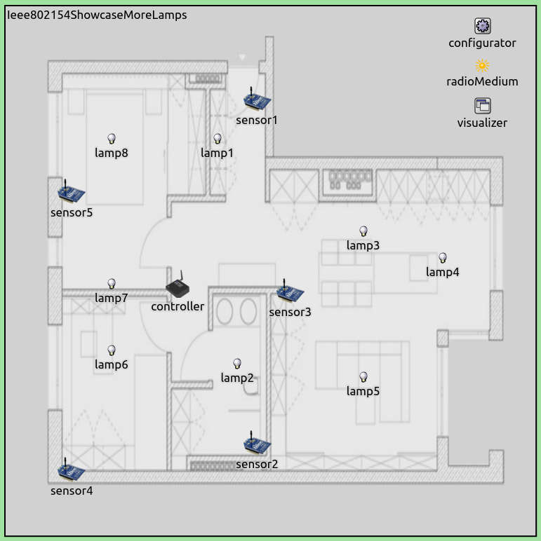
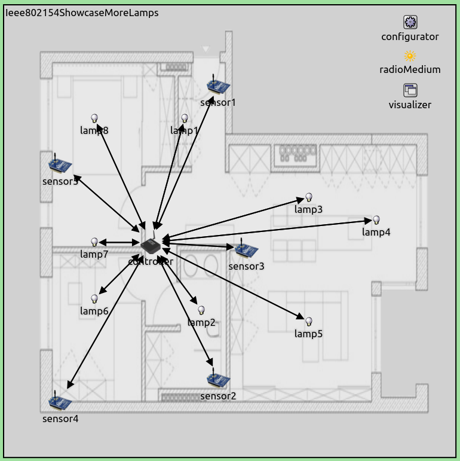

## Goals

IEEE 802.15.4 is a widely used standard for wireless sensor networks. INET has support for simulating various IEEE 802.15.4 physical and MAC layers. This showcase demonstrates the narrow band IEEE 802.15.4 model available in INET. It contains one example simulation which features a wireless sensor network.

INET version: `4.0` 
Source files location: <a href="https://github.com/inet-framework/inet-showcases/tree/master/wireless/ieee802154" target="_blank">`inet/showcases/wireless/ieee802154`</a>

## The model

- about ieee 802154 modes, topology, ffds and rfds
- about the inet implementation
- the scenario
- the configuration

IEEE 802.15.4 is a standard that defines the physical layer and media access control (MAC) layer of low-rate wireless personal area networks (LR-WPANs). LR-WPANs are low power, low throughput communication networks, which can be used for creating wireless sensor networks (WSNs), Internet-of-things applications, etc.
A brief overview of the standard follows. `TODO: if it turns out to be short, this is not needed`

The IEEE 802.15.4 standard defines multiple physical layer specifications (PHYs), based on different modulations, such as Direct Sequence Spread Spectrum (DSSS), Chirp Spread Spectrum (CSS), Ultra-wideband (UWB). It defines a CSMA-CA or ALOHA MAC-layer protocol as well.
`merge these two?`

<!-- INET has two IEEE 802.15.4 PHY models, a narrow band version and an ultra-wideband version: `Ieee802154NarrowBandScalarRadio` and `Ieee802154UwbIrRadio`.
The narrow band version uses DSSS-OQPSK modulation, the ultra wide-band version NOPE -->

<!-- ### About the INET implementation

INET has two IEEE 802.15.4 models:

- `Ieee802154NarrowBandScalarRadio`: A narrow band IEEE 802.15.4 PHY model using DSSS-OQPSK modulation (scalar)
- `Ieee802154UwbIrRadio`: An ultra-wideband IEEE 802.15.4 PHY model (dimensional)

This showcase demonstrates the narrow band version.

The `Ieee802154NarrowBandScalarRadio` is a scalar model. It uses DSSS-OQPSK modulation, and operates at 2450 MHz. By default, the transmissions have a 2.8 MHz bandwidth and 250 kbps data rate, and 2.24 mW transmission power.

`or maybe should start with the interface?`

`more details on the narrow band...defaults, etc...` -->

<!-- TODO
Frequency bands, topologies, ffd's and rfd's...is that needed here?
Also, the available inet implementations...maybe that shouldnt be here

INET has the following IEEE 802.15.4 models available:

INET has a narrowband and an ultra-wideband IEEE 802.15.4 physical layer implementation. The narrow band version uses the DSSS-OQPSK modulation, the modules are `Ieee802154Ieee802154NarrowbandScalarRadio`, and `Ieee802154NarrowbandScalarRadioMedium`. The ultra-wideband implementation modules are `Ieee802154UwbIrRadio` and `Ieee802154UwbIrRadioMedium`.

TODO:
they have sensible defaults, by default operating on 2.45 GHz, 2.8 MHz bandwidth, 250 kbps, 2.24 mW transmission power. The uwbir has what parameters and defaults ? except for none. By the way, its operating on 4.5 GHz, 500 MHz bandwidth, 850 kbps data rate.
The narrowband version is scalar, the uwbir version is dimensional -> actually, it makes sense,
because the uwbir version occupies a lot of the spectrum

UPDATE:
this showcase only contains the narrow band version -->

<!-- So the structure should be something like this:

- About Ieee 802154
- About the inet implementation...the narrowband, just mention there is an uwbir
some details about them...and more details about the narrowband
- the configuration and the screnario
- results -->

### The INET implementation

INET features a narrow band and an ultra-wideband IEEE 802.15.4 PHY model:

- `Ieee802154NarrowBandScalarRadio`
- `Ieee802154UwbIrRadio`

This showcase demonstrates the narrow band model. `Ieee802154NarrowbandScalarRadio` uses DSSS-OQPSK modulation, and operates at 2.45 GHz. By default, the transmissions have a bandwidth of 2.8 MHz, and 2.24 mW transmission power. `TODO: its scalar`

The `Ieee802154NarrowbandInterface` module contains a `Ieee802154NarrowbandScalarRadio` and the corresponsing `Ieee802154NarrowbandMac`. The radio should be used with `Ieee802154NarrowbandRadioMedium`. `TODO: some defaults...path loss type, etc`

`They have sensible defaults? so no configuration is needed/works out of the box`

### The configuration

The showcase contains an example simulation, which demonstrates the operation of INET's narrow band IEEE 802.15.4 model. The scenario is that wireless nodes are used to control lighting in an apartment. There are sensor nodes in the rooms working as presence sensors, detecting when people are in a room.
They periodically send sensor data to a controller node, which decides how to adjust the lighting conditions in different rooms. The controller sends control packets to the lamps in the rooms to set their brightness or turn them on and off. All nodes use the IEEE 802.15.4 standard to communicate.
Note that this is not a working simulation of the light control and presence detection, just a mockup based on that scenario - only the periodic communication of the nodes are simulated.

The simulation can be run by choosing the `Ieee802154` configuration from <a srcFile="wireless/ieee802154/omnetpp.ini"/>. It uses the following network:

The network contains a number of wireless nodes of the host type `Ieee802154Node`, which is defined in <a srcFile="wireless/ieee802154/Ieee802154Showcase.ned"/>:

<pre class="include" src="Ieee802154Showcase.ned" from="Ieee802154Node" upto="}"></pre>

`TODO: description`
`this is custom host type defined to ... actually, it would be maybe easier to just use an adhocHost
and set wlan type to Ieee802154NarrowbandInterface? which is more concise ?` `nope this one shows that it can be done this way which might be more helpful`

The network also contains an `Ipv4NetworkConfigurator`, an `Ieee802154NarrowbandScalarRadioMedium`, and an `IntegratedVisualizer` module.

<pre>
- routes config -> star topology
- app config
- ieee802154 config? if there is any

- results

some power statistics ? maybe compare to the case if it was done with wifi?
</pre>

Routes are set up according to a star topology, with the controller at the center. This is achieved with the following configuration of `Ipv4NetworkConfigurator` defined in the `startopology.xml` file:

<pre class="include" src="startopology.xml"></pre>

 The following image shows the routes:

All sensors will send packets to the controller, and the controller will send packets to the lamps.
<!-- `more detailed description including the app configs` -->

Here is the app configuration from <a srcFile="wireless/ieee802154/omnetpp.ini"/>:

<pre class="include" src="omnetpp.ini" from="numApps" until="routing table visualization"></pre>

All sensors will send one 10-byte UDP packet to the controller each second, with randomized start times. The controller will send one 10-byte UDP packet per second as well. The controller's app is an `UdpBasicApp`, and all lamp nodes are specified in its `destination` parameter. If multiple destinations are specified in `UdpBasicApp`, a random destination is chosen for each packet. Thus each packet will be destined to a different lamp.

`There is no need for 802.15.4 configuration, it works out of the box...some values of the 802154 model`

## Results

`some details of the 802.15.4, for example in the packet inspector
some details in the config section? power statistics without comparison`

<video autoplay loop controls max-width-percent="60" onclick="this.paused ? this.play() : this.pause();" src="Ieee802154_1.mp4"></video>
