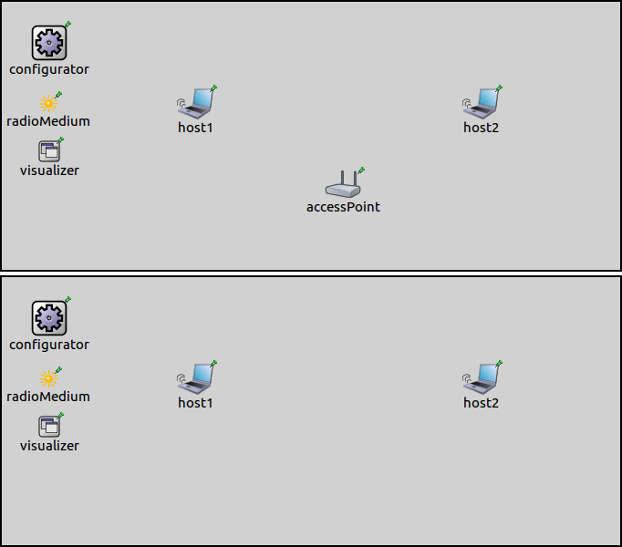

## Goals

802.11 devices can operate in two basic modes. In infrastructure mode, nodes connect to wireless networks created by access points, which provide services, such as internet access. In adhoc mode, nodes create an adhoc wireless network, without using additional network infrastructure. <!--which they can use to transfer data between each other.-->

INET has support for simulating both operating modes. This showcase demonstrates how to configure 802.11 networks in infrastructure and adhoc mode, and how to check if they are configured correctly. The showcase contains two example simulations defined in omnetpp.ini.

INET version: `4.0` 
Source files location: <a href="https://github.com/inet-framework/inet-showcases/tree/master/wireless/infrastructure" target="_blank">`inet/showcases/wireless/infrastructure`</a>

## The model

- you need to use the correct management module
- there is simple and normal management modules

The operating mode of a node is determined by the type of management module the node has.
The management module type can be set from ini or ned, or by using a host type which has the proper
management module type by default.

In INET, the management module is a submodule of `Ieee80211Nic`. It connects to the MAC module, and it is responsible for handling management frames, such as beacon frames, probe request and response frames, and association and authentication frames. The management module is also responsible for scanning channels and switching between them. Several types of management modules are available:

- `Ieee80211MgmtSTA`: for stations (nodes that join wireless networks) in infrastructure mode
- `Ieee80211MgmtAP`: for access points in infrastructure mode
- `Ieee80211MgmtAdhoc`: for nodes in adhoc mode

<!--
There is the simplified versions of all of these except the adhoc
Which hosts have them
The role of agent modules
-->

TODO: the simplified versions dont implement beacons, probes, association, authentication
they only send and receive data frames and treats all stations as if they were associated

There are also simplified versions of the infrastructure mode management modules, `Ieee80211MgmtSTASimplified` and `Ieee80211MgmtAPSimplified`. These modules don't simulate the association and authentication process, but assume that stations are already associated with the access point. They also cannot simulate handovers.

The agent module (`Ieee80211AgentSTA`) is the submodule of `Ieee80211Nic` in devices that act as stations (nodes with `Ieee80211MgmtSTA` management module types, connecting to wireless networks). It connects to the management module. It is responsible for initiating channel scanning, associations and handovers. It control these by sending commands to the management module.
It basically simulates user actions, such as the user instructing the device to connect to a Wifi network.
The topology of connected modules in `Ieee80211Nic` is displayed on the following image:

Hosts can be configured to use infrastructure or adhoc mode by specifying the corresponding management module type. By default, `WirelessHost` uses `Ieee80211MgmtSTA`, and `AccessPoint` uses `Ieee80211MgmtAP`.
`AdhocHost` is suitable to adhoc wireless networks. It is derived from `WirelessHost` by changing management module to `Ieee80211MgmtAdhoc` (and also turning on IPv4 forwarding.)

In infrastructure mode, the SSID of the network created by an access point is a parameter of `Ieee80211MgmtAP`, and it is "SSID" by default. In stations, the agent module has an SSID parameter, which sets which network the node should join. When the simulation is run, the access points automatically create the wireless network, and the agent module in station nodes cause them to automatically join the appropriate network.

TODO: about the adhoc management module

## The configuration

The showcase contains two example simulations, with one of them demonstrating infrastructure mode and the other adhoc mode (the configurations in omnetpp.ini are named `Infrastructure` and `Adhoc`.) Two nodes communicate wirelessly in both of them, the difference being that in the first case they communicate through an access point in infrastructure mode, and in the second directly between each other in adhoc mode. The two simulations use similar networks, the only difference is that there is an access point in the network for the infrastructure mode configuration. The networks look like the following:

The networks contain two `WirelessHosts` named `host1` and `host2`.
They also contain an `Ipv4NetworkConfigurator`, an `Ieee80211ScalarRadioMedium` and an `IntegratedVisualizer` module. The network for the infrastructure mode configuration also contains an `AccessPoint`.

TODO: the configuration

<video autoplay loop controls onclick="this.paused ? this.play() : this.pause();" src="Infrastructure1.mp4"></video>

<video autoplay loop controls onclick="this.paused ? this.play() : this.pause();" src="Infrastructure2.mp4"></video>

second one seems better

<pre>
Hosts in infrastructure mode will connect to the access point
Where to configure SSID
</pre>

<pre>
How does it work? In infrastructure mode, the agent module initiates connecting to the wireless network.
In adhoc mode, they are assumed to be connected.
</pre>

<pre>
The mgmtAdhoc module has an SSID parameter. It will create a wireless network with this SSID
The agent module has an SSID parameter -> the node will connect to that network
</pre>

<pre>
some of these might belong to the next section (the configuration)
</pre>
