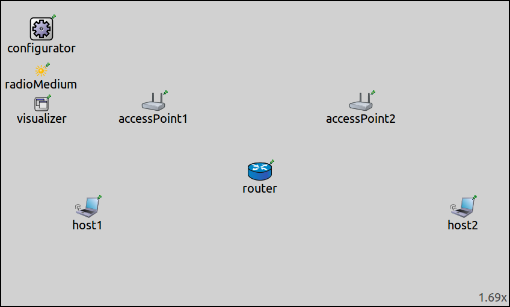

## Goals

In reality, devices often have more than one wireless interface (for example, a dual band wireless router has two radios.) Wireless nodes in INET can have multiple interfaces as well.
This showcase contains an example simulation, in which nodes communicate via a router, which has two wireless interfaces.

INET version: `4.0` 
Source files location: <a href="https://github.com/inet-framework/inet-showcases/tree/master/wireless/infrastructure" target="_blank">`inet/showcases/wireless/infrastructure`</a>

## The model

- by default, most hosts in INET have just one radio
- but the number of radios can be set by a parameter
- actually, you can build any kind of host with any number of radios
- but it is easy by setting the numWlanIntefaces parameter
- i think even StandardHost has one
- it is part of the LinkLayerNodeBase

<!--
INET's wireless host types have one wlan interface by default.
The number of wlan interfaces in a host is specified by the host's `numWlanInterfaces` parameter. The parameter's default value is 1 for wireless hosts, such as `WirelessHost` and `AdhocHost`, and 0 for `StandardHost`.
-->

The number of wlan interfaces in INET's host types is specified by the host's `numWlanInterfaces` parameter. The parameter's default value is 1 for wireless hosts, such as `WirelessHost` and `AdhocHost`, and 0 for `StandardHost`. (`numWlanInterfaces` is actually the parameter of `LinkLayerNodeBase`, on which these host types are built.) <!--However, one can specify a custom host type with arbitrary number of radio interfaces in the NED file.-->
However, one can build a custom host type from scratch with an arbitrary number of radio interfaces in the NED file.

### The configuration

The example simulation for this showcase uses the following network:

The network contains two `WirelessHost`s named `host1` and `host2`, two `accessPoint`s (`accessPoint1` and `accessPoint2`), and a `Router`.
The network also contains an `Ipv4NetworkConfigurator`, an `Ieee80211ScalarRadioMedium` and an `IntegratedVisualizer` module.

<!--
By default, INET's wireless host types (such as `WirelessHost` and `AdhocHost`) have one wlan interface.
-->

- TODO: using 802.11
- the router has two radios operating on different channels
- the hosts are configured to ping each other
- the scenario is that each host uses a different channel
- each host connects to one of the access points
- the access points are connected to the router...one of the radios of the router
- actually, the router connects to each access point with each of its radios
- the managementtype is set to simplified
- the routes are configured
- the visualizers are configured -> is this needed?

The access points will create wireless networks on different channels. Each host will associate with the nearby access point. The router will have two wireless interfaces, and will connect to both access point with one of its interfaces. The two wireless networks will be connected via the router, and `host1` will ping `host2`.

<!--
The two access points will create wireless networks on different channels. `host1` will be associated with `accessPoint1`, and `host2` with `accessPoint2`. The router will connect to both networks, using one of its radio interfaces for each network. `host1` is configured to ping `host2`. The ping packets will go through the router.
-->

- config

All nodes configured to use simplifies management modules, thus all hosts are assumed to be already connected to the wireless network at the start of the simulation.

`accessPoint1` is configured to create the wireless network on channel 0, and `accessPoint2` on channel 1.
`host1` is configured to be connected to `accessPoint1`, and `host2` to `accessPoint2`.
The number of radios in `router` is set to two, and each radio is configured to connect to the appropriate wireless network. TODO: the access point mac address and the channel needs to be set because of the simplified management

<pre class="include" src="../../wireless/multiradio/omnetpp.ini" from="001111111111" until="simplified" comment="#"/>

TODO: also, host1 pings host2
