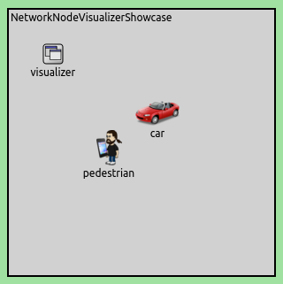

## Goals

In network simulations, it is essential to visualize the participants of
communication. Customizing nodes' appearance may also be important, for
example to highlight nodes or to distinguish nodes based on location or function.
In complex networks with many nodes, it also can be useful to visualize only the
nodes we are interested in.

This showcase demonstrates how network nodes are visualized in INET
simulations.

INET version: `3.6`<br>
Source files location: <a href="https://github.com/inet-framework/inet-showcases/tree/master/visualizer/networknode" target="_blank">`inet/showcases/visualizer/networknode`</a>

## About the Visualizer

In INET simulations, `NetworkNodeVisualizer` module (included in the
network as part of `IntegratedVisualizer`) is responsible for visualizing
network nodes. `NetworkNodeVisualizer` includes two submodules: 
`NetworkNodeCanvasVisualizer` and `NetworkNodeOsgVisualizer`.

All nodes can be visualized on a 2D canvas by `NetworkNodeCanvasVisualizer` 
and on a 3D scene by `NetworkNodeOsgVisualizer`. We can narrow the list of nodes 
to be displayed by using the `nodeFilter` parameter.
The name of the node is displayed by default, but it can be hide by setting the
`displayModuleName` parameter to `false`.

### Visualization on a 2D canvas

`NetworkNodeCanvasVisualizer` is responsible for displaying nodes on a 2D canvas. 
On the 2D canvas, each node is represented by an icon. The icon of the node can be 
customized  by setting the display string of the node in the network description file (NED). 
The display string can be set by tags. We can customize the icon 
by specifying the `i` display string tag. It has three arguments:
- The first argument specifies the icon to be used. The `i` display string tag is used 
to find the image, just like with the OMNeT++ image path or the `cIconFigure` class.
- The second argument specifies the color of the icon, and it accepts English color names 
(more precisely, SVG color names) and HTML-style RGB values.
- The third argument defines the colorization amount of the icon. It is as a number 
between zero and one. Number one means full colorization.

We can set the size of the icon by using the `is` display string tag. The size can be 
`vs` (very small), `s` (small), `n` (normal), `l` (large) and `vl` (very large).

(**NOTE:** All supported display string tags are listed in the 
<a href="https://omnetpp.org/doc/omnetpp/manual/#cha:display-strings" target="_blank">OMNeT++ Simulation Manual</a>.)

### Visualization on a 3D scene

TODO: in OSG view mode Y axis starts in the opposite direction

`NetworkNodeOsgVisualizer` is responsible for displaying nodes on a 3D scene.
(In this version of INET, `IntegratedVisualizer.osgVisualizerType` must be set 
to `IntegratedOsgVisualizer` for visualizing nodes in 3D, because this parameter 
is empty by default.)
`OMNeT++`'s 3D visualization is based on the open-source `OpenSceneGraph` (osg) and 
`osgEarth` libraries. These libraries offer high-level functionality, 
such as the ability of using 3D model files directly, accessing and rendering 
online map and satellite imagery data sources, and so on. In this showcase, we deal
only with 3D models and we do not deal with maps. You can learn about osg maps 
in the <a href="https://inet.omnetpp.org/inet-showcases//visualizer/earth/" target="_blank">Visualizing Terrain and Urban Environment</a> showcase.

By default, each node is represented by a 2D icon on the osg scene which is set 
in the display string of the node. If we want to replace the 2D icon to a 3D model, 
we need to load external resources, for example images or 3D models. 
The resource we want to load is specified in the `osgModel` parameter of the node.
By default, the `OMNeT++` image path is used to find the image.

**NOTE:** Here are some supported file formats:
- geometric file formats: 3dc, 3ds, flt, geo, iv, ive, lwo, md2, obj, osg, osgb,
- image file formats: bmp, gif, jpeg, rgb, tga, tif.

By using the `osgModel` parameter, we can scale, rotate and translate the 3D model.
The `osgModel` parameter is used as follows:

Firstly, we have to set the 3D model's file name that will represent the network node.
After this, we can use the `scale`, `trans` and `rot` keywords to transform the model.
These arguments can be used in any order and separated by dots. The model's size 
will be multiplied with the number before the `scale` keyword. If we want to use 
decimal fraction like *0.8*, it must be written between parentheses, e.g `(0.8).scale`.
By using `trans` keyword, the model can be translated by a certain value along 
the X, Y and Z axes. The values separated by commas. The format is `X,Y,Z.trans`.
Using `rot` keyword is similar to using `trans` but it will rotate the model 
around the X, Y and Z axes, e.g `X,Y,Z.rot`.

Examine the following example.

`*.exampleNode.osgModel = "example.osg.2.scale.0,0,10.trans.180,0,90.rot"`.<br>

- `example.osg` is the file name of the external 3D model that represents 
the `exampleNode` network node
- `2.scale` scales `example.osg` to 200%
- `0,0,10.trans` translates `example.osg` 10 units upwards
- `180,0,90.rot.rot` rotates `example.osg` 180 degrees around the X axis 
and 90 degrees around the Z axis
- The parts of the parameter string are separated by dots.

Color of the 3D model also can be changed by using the `osgModelColor` parameter.
This parameter accepts English color names (more precisely, SVG color names) 
and HTML-style RGB values.

**NOTE** More information about `OpenSceneGraph` can be found on the 
<a href="http://www.openscenegraph.org" target="_blank">OpenSceneGraph web site</a> 
and in dedicated `OpenSceneGraph` books.

## Customizing Appearance of Network Nodes

This example shows how the nodes' look can be customized. A simulation is created
for this example, it can be run by selecting the `VisualizingNodes`
configuration from the ini file.

The network contains two `AdhocHosts`, `pedestrian` and
`car`. We change the default icon of `pedestrian` by
modifying its display string in the
`NetworkNodeVisualizerShowcase.ned` file. (Note that the default icon also
can be modified in the node's *Properties* on the *Appearance* tab.)

``` {.snippet}
car: AdhocHost {
    @display("p=168,117;i=misc/car2");
    }
pedestrian: AdhocHost {
    @display("p=113,156;i=misc/person3");
    }
}
```

On the 2D canvas, a car and a person with a smartphone can be seen, 
representing `car` and `pedestrian`. The `p` display string tag defines 
the position of the nodes. The (0,0) position is in the upper left corner 
of the playground.



On the 3D osg scene, you can see the same icons as on the 2D canvas.
The icons are automatically rotating towards the camera.


In our next experiment, we replace the nodes' icon with external 3D models by
using the following configuration.

``` {.snippet}
*.pedestrian.osgModel = "boxman.osgb.(0.3).scale.0,0,45.rot"

*.car.osgModel = "car.osgb.200.scale.0,0,45.rot"
*.car.osgModelColor = "red"
```

This configuration affects only 3D visualization. The following animation shows
how the nodes look like after we have replaced their icon.

<p><video autoplay loop controls onclick="this.paused ? this.play() : this.pause();" width="774" height="490" src="CustomizedRotateCam_v2.mp4"></video></p>

The `pedestrian` node is represented by an animated walking
boxman and `car` is represented by a car model instead of 2D
icons. The 3D models make the nodes recognizable even without
displaying the module's name.

<!-- TODO: Hogy kell iranyba allitani a modelt, mozgas kozben merre fordul -->


<!-- / -->

## More Information

This example only demonstrated the key features of network node visualization.
For more information, refer to the `NetworkNodeVisualizer`, `NetworkNodeCanvasVisualizer` 
and `NetworkNodeOsgVisualizer` NED documentations.

<!--
## Discussion

Use <a href="https://github.com/inet-framework/inet-showcases/issues/"
target="_blank">this page</a> in the GitHub issue tracker for commenting on
this showcase.
-->
